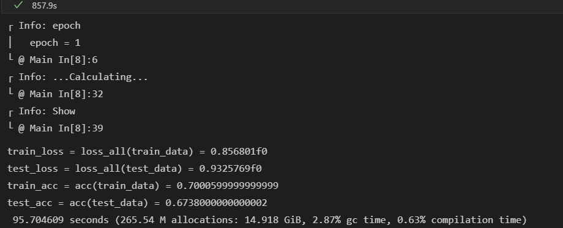
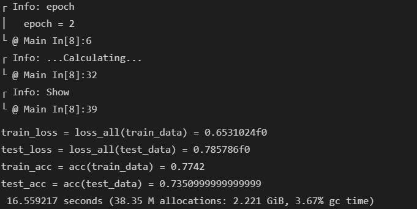
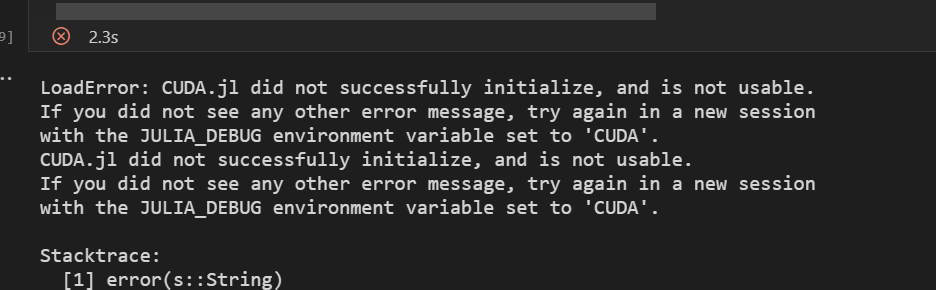

# Julia: VGG16 and ResNet18

## Motivation
The bottleneck of deep learning, which involves large-scale architectures, is training time. Python is a popular language for deep learning. However, it is slow when it handles large volumes of data. Julia is Python-like but is faster than Python because Julia uses Just-In-Time compilation. Simply, Julia combines C and Python. Having said that, there are fewer resources available, and it is difficult to implement a model in Julia. This project shows how to implement VGG16 and ResNet18 from scratch with Cifer10.

## 1. Requirements
- Julia ==> 1.6
- CUDA ==> 3.4.2
- DataFrames ==> 0.21.8
- Flux ==> 0.11.3
- MLDataUtils ==> 0.5.4
- MLDatasets ==> 0.5.11
- Plots ==> 1.21.2

*Julia cares for packages' version. If you see any errors, please make sure the versions are correct.

## 2. Julia Aspects
Q. Is the first run slow? 
A. Yes, it will be slow because Julia transfers all of the data to a local GPU. 
The below picture shows that the first epoch takes 95 seconds due to the trandering.
 
Then, the second run will be quicker, but the speed depends on your GPU environment. 
In our case, Julia redcued the time 9 times from the first epoch.
 

Q. Why does Julia provide OOM? 
A. This is due to Just-In-Time compilation. 
When you train a model in Julia, each time Julia leaves a cache on your GPU. Thus, the GPU is getting heavier and slower. 
To avoid the situation, you should turn off the terminal and make sure there is no cache left on your GPU.
 

## 3. Results

### VGG16
| Language | Epoch | Time (seconds) | Train Accuracy | Train Loss | Test Accuracy | Test Loss |
Julia    & 5     & 33.721         & 0.758          & 0.682      & 0.714         & 0.827     \\ \hline
Julia    & 45    & 33.664         & 0.971          & 0.086      & 0.766         & 1.354     \\ \hline
Julia    & 50    & 33.695         & 0.991          & 0.027      & 0.787         & 1.216     \\ \hline
Python   & 5     & 30             & 0.726          & 0.799      & 0.580         & 1.254   \\ \hline
Python   & 45    & 29             & 0.974          & 0.078      & 0.750         & 1.261    \\ \hline
Python   & 50    & 29             & 0.976          & 0.074      & 0.756         & 1.214     \\ \hline
